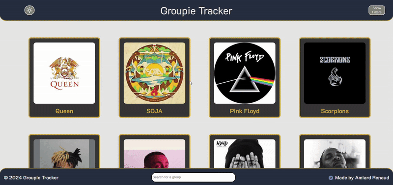

<p align="center">
  
</p>

---

## 📖 Table of contents

1. 🤔 [What is HangMan Web ?](#a-namewhat-is-groupietracker--what-is-groupie-tracker-a)
2. ▶️ [Visit](#a-namevisit--visit-a)
3. 🗃️ [File architecture](#a-namefile-architecture--file-architecture-a)
4. 🛠️ [Installation](#a-nameinstallation--installation-a)
5. 🛜 [Run the server](#a-namerun-the-server--run-the-server-a)
6. 🔮 [Extra features](#a-nameextra-features--extra-features-a)  
   6.1 🌄 [ Light and Dark mode](#a-name61-light-and-dark-mode--light-and-dark-mode-a)  
   6.2 🧮 [ Dynamic filters](#a-name62-dynamic-filters--dynamic-filters-a)  
   6.3 🧠 [ Predictive search-bar](#a-name63-predictive-search-bar--predictive-search-bar-a)  
   6.4 🗺️ [ Interactive map](#a-name64-interactive-map--interactive-map-a)
7. 🌐 [Credits](#a-namecredits--credits-a)
8. 📎 [Appendix](#a-nameappendix--appendix-a)

## <a name="what-is-groupietracker"> 🤔 What is Groupie Tracker ?</a>

**Groupie Tracker** is a school project that aims to make a WebApp that references some artists/groups and displays  
some information about them. 

The educational role of this project is to learn how to manipulate fetched data from a REST API and display them on a 
website.  
And also improving our skills in HTML/CSS/Go, and deepen our skills in managing HTTP request.

The WebApp gives informations such as the creation date, number of member, list of concerts etc... 

- On the 'Home Page' of the WebApp you can see a grid that contains all the artists present in a API that you can filter.
- On the 'Group Page' you can see all the informations concerning the selected group/artist


## <a name="visit"> ▶️ Visit </a>


## <a name="file-architecture"> 🗃️ File Architecture </a>

```txt
groupie-tracker/
├─ Cmd/
│  └─ main.go
├─ Data/
│     └─ ...
├─ Internal/
│  ├─ Api/
│  │  ├─ DataExtraction.go
│  │  ├─ EntriesChecking.go
│  │  ├─ Filters.go
│  │  ├─ SearchGroups.go
│  │  └─ Structures.go
│  └─ Server/
│     ├─ Routes.go
│     └─ StartServer.go
└─ Web/
   ├─ Handlers/
   │  ├─ GroupPageHandler.go
   │  ├─ HomePageHandler.go
   │  └─ SearchPageHandler.go
   ├─ Static/
   │  ├─ alternativeGroupPage.css
   │  ├─ alternativeHomePage.css
   │  ├─ changeCSS.js
   │  ├─ dualRange.js
   │  ├─ groupPage.css
   │  ├─ homePage.css
   │  ├─ img/
   │  │  └─ linkedin-icon.svg
   │  ├─ interactiveMap.js
   │  └─ searchBar.js
   └─ Templates/
      ├─ GroupPage.gohtml
      ├─ HomePage.gohtml
      └─ SearchResults.gohtml
   ```

## <a name="installation">  🛠️ Installation </a>

To install the game, you will need to have on your machine :

[](https://git-scm.com/downloads)
[](https://go.dev/dl/)

### Installation with GitBash
```bash
git clone https://ytrack.learn.ynov.com/git/arenaud/groupie-tracker.git
cd groupie-tracker/
```

## <a name="run-the-server"> 🛜 Run the server </a>

### Run the program with CLI
Run the Groupie Tracker with the cmd using the Go command ``` go run Cmd/main.go```

A firewall prompt will appear, be trustfully 😊 Golang need that to run the server 

The server will be hosted on your localhost address on the port **8080**  
Anybody on your local network can access it by entering your Ip Address with the provided port 

The 'Home Page' is the '/' route
___


## <a name="extra-features"> 🔮 Extra features </a>

In this section you will see all the additional features

### <a name="61-light-and-dark-mode"> 🌄 Light and Dark mode </a>

By clicking on the sun on the top left you will be switched for Light mode to Dark mode  
for a more comfortable experience 😉



> Note : The Light/Dark mode is available on all pages

### <a name="62-dynamic-filters"> 🧮 Dynamic filters </a> 


You can filter the artists with few built filters :

- By Creation Date (**range**) 
- By Number of Members (**checkbox**)
- By First Album Release Date (**range**)
- By Country where the artist/group has performed (**drop-down list**)

> Note : The 'min'/'max' values are dynamics, and they adapt API value


### <a name="63-predictive-search-bar"> 🧠 Predictive search-bar </a>

___


You have 2 ways to search an artist/group :

#### Sending the search :
By using the search bar and send your search query  
After that the website will display the corresponding artists/groups,  
and you can filter those results.


___


#### By using the predictions : 

As you can see on the previous GIF, you can also do  
search by clicking on the predictions


### <a name="64-interactive-map"> 🗺️ Interactive map </a>

___

We used the **[MapBox API](https://www.mapbox.com/)** to display a fully interactive map on our WebApp 

We customised the map by using the **MapBox Studio** to choose the way the map is displayed, the road color etc... 

All the group/artist concert can be see **by the markers** on the map  
by the way those markers display a popup with the city name and all the dates 

> NOTE : ❕When you go on the group/artist page, a animation start, this animation parcours all the markers ❕


## <a name="credits"> 🌐 Credits <a/>

- [@arenaud](https://ytrack.learn.ynov.com/git/arenaud)
- [@cagaetan](https://ytrack.learn.ynov.com/git/cagaetan)

## <a name="appendix"> 📎 Appendix <a/>

- 📚[Our Trello](https://trello.com/b/IN8SLypu/)
- 🖼️[Project presentation](https://www.canva.com/design/DAGgVO7FBro/_PAEVbOfaerMdLYEqhl89A/view?utm_content=DAGgVO7FBro&utm_campaign=designshare&utm_medium=link2&utm_source=uniquelinks&utlId=h0d87f6b81f)
- 🗃️[Gitea Repository](https://ytrack.learn.ynov.com/git/arenaud/groupie-tracker.git)

